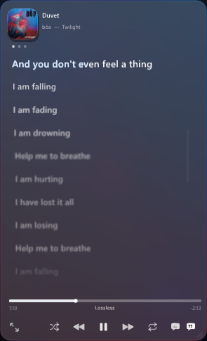

# Matcha Song Cover Referance

A standalone Windows music-player overlay reference built with C++20, Dear ImGui, and Direct3D 11.

This repository contains only the player, media backend, and preview host. It does not contain the rest of Cover, game integration, or NVIDIA overlay code.



## Features

- Reads the active media session through Windows GSMTC
- Prioritizes Spotify Desktop, with an option to accept other media apps
- Loads synchronized lyrics from LRCLIB
- Uses GSMTC album art immediately, then upgrades it with higher-resolution catalog artwork
- Extracts three dominant cover colors for a blurred, animated background
- Compact, lyrics, artwork, and fullscreen layouts
- Playback, shuffle, repeat, seeking, and clickable lyric controls
- `Aa` toggles lyrics inside artwork mode
- Manual lyric scrolling waits five seconds before following playback again
- Resizable and movable ImGui window

## Build

Requirements:

- Windows 10 1809 or newer
- Visual Studio 2022 Build Tools with the Desktop development with C++ workload
- Windows 10 or 11 SDK

Run:

```bat
build_preview.bat
```

The executable is written to `bin\NativeMusicPlayerPreview.exe`.

Dear ImGui is included under `third_party/imgui` with its original license. No Spotify credentials are required. Spotify provides playback through GSMTC; lyrics come from LRCLIB, and the optional artwork upgrade uses Apple's public search catalog.

## Layout

- `src/media.cpp`: GSMTC state, playback controls, lyrics, and artwork lookup
- `src/player/background.cpp`: dominant-color extraction and animated atmosphere
- `src/player/artwork.cpp`: Direct3D artwork and blurred-field textures
- `src/player/controls.cpp`: timeline and transport controls
- `src/player/header.cpp`: artwork, metadata, view switching, and `Aa`
- `src/player/lyrics.cpp`: synchronized lyrics, scrolling, and lyric seeking
- `src/player/player.cpp`: window state and layout coordination
- `preview/`: small Win32 and Direct3D 11 host used to run the player

## Integration

The UI talks to its host through `include/music_player_host.h`. Implement those drawing, animation, font, window, and D3D-device functions in another ImGui project, then call `native_music_player::DrawMusicPlayer()` once per frame.

The visuals are a clean-room reference implementation based on supplied screenshots. The project does not include Matcha source code or depend on NVIDIA GeForce Overlay.
